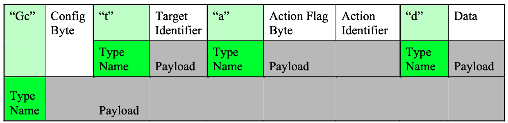
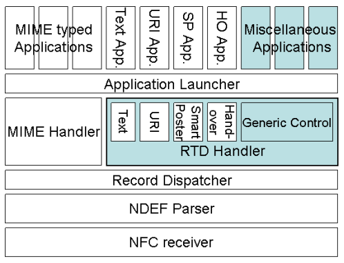

# Generic Control Record Type Definition

## Generic Control

通用控制RTD提供了一种简单的, 可以通过NFC通信从一个NFC论坛设备, 标签或卡 (源设备) 向NFC论坛设备 (目标设备) 虚拟请求任何特定操作的方法. 

它的设计理念是:

* 访问MIME类型记录或其他NFC论坛全局类型记录未涵盖的功能或应用程序.
* 源设备明确指示目标设备上的特定功能或特定应用程序以执行指定数据的特定操作. *个人理解: 源设备调用目标设备上的函数(源设备存储的参数)*

## NDEF Structure

### Record Mapping

通用控制载荷的内容是一个 NDEF 消息.

一个控制记录包含如下组件:

* 一个配置字节: 用于指定多个配置文件, 以帮助确定如何处理其余的载荷
* 目标记录: 用于标识处理通用控制记录中包含的数据的功能.
* 动作记录: 用于为目标记录所标识的功能指定处理数据的动作.
* 数据记录: 用于指定要由目标记录标识的功能处理的数据.

通用控制记录的结构图:

说明:

通用控制记录的类型定义中没有定义子记录 - 目标记录, 动作记录, 数据记录 - 的顺序. 一般建议先指定目标记录, 在后指定动作记录, 再指定数据记录.

* "Gc": 通用控制记录类型的作为总所周知类型(The Well-known Type)的名称. 采样 NFC 二进制编码为: 0x47, 0x63.
* Config Byte: 配置字节. 是 "Gc" 记录的载荷的第一个字节. 其位域的含义见表-Config-Byte. 
* "t": 目标记录的类型名. Target Identifier: 是目标记录描述的标识.
* "a": 操作记录的类型名.
* "d": 数据记录的类型名.

表-Config-Byte:

| Bit  | 名称     | 符号 | 解释                                     |
| ---- | -------- | ---- | ---------------------------------------- |
| 0    | 保留     | -    | 必须为 0                                 |
| 1    | 顺序控制 | SC   | 1: 检查退出条件.                         |
| 2    | 顺序控制 | EC   | 1: 当这条记录未处理成功, 则忽略后续记录. |
| 3..7 | 保留     |      | 必须为 0                                 |

### 多条记录的顺序控制

当顶层的 NDEF 消息中包含多条通用控制记录, 建议假定这些记录期望以先进先出(FIFO) 的方式处理. 只应有一条通用控制记录出现在顶级 NDEF 消息中.

配置字节中的顺序控制标志指明了在多个通用控制记录处理过程中如何终止的条件.

### 子记录

以下的记录类型作为本地类型定义. 作用域仅限于一条通用控制记录里.

#### 目标记录

类型名为 "t" (0x74). 一条通用控制记录必须包含一条且仅包含一条目标记录. 目标记录包含一个 Text RTD[[RTD-text]] 记录或者 URI RTD 记录. 目标设备应负责子记录内容的翻译. 如果目标设备不理解子记录的内容, 则目标设备应只忽略包含未解析目标记录的通用控制记录.

#### 动作记录

类型名为 "a"(0x61). 它指定目标函数处理数据所需的动作. 一条通用控制记录最多包含一条动作记录. 当省略动作记录时, 可以应用该功能的默认动作. 默认动作取决于每个功能. 如果用目标记录或目标设备的所有实体都不理解动作记录的内容, 则应该简单地忽略通用控制记录. 对动作记录内容的解释取决于目标功能. 

在动作记录的载荷中包含一个动作记录标志字节和一个数据记录.

动作 Flag 字节:

| Bit  | 名称                   | 符号 | 含义                                                         |
| ---- | ---------------------- | ---- | ------------------------------------------------------------ |
| 0    | 数值代码(Numeric Code) | NC   | 1: 使用数值代码指定动作(数值代码见表-Numeric-Code) 0: 动作记录的内容以一条完整的 NDEF 记录描述, 比如: 文本记录, MIME 类型记录等. 目标函数应能够解释数据以执行预期的动作. |
| 1..7 | 保留                   | -    | 必须为 0                                                     |

表-Numeric-Code:

| 值    | 含义                                                         |
| ----- | ------------------------------------------------------------ |
| 0     | 目标函数的默认动作. (例如: 在浏览器中打开网页. 拨打电话等)   |
| 1     | 保存. (例如: 添加 URL 到Web 浏览器中, 存储作为电话号码的数据到联系人列表中等等) |
| 2     | 打开进行编辑. (例如: 将数据作为电话联系人, 在联系人编辑器中打开) |
| 3..FF | 保留                                                         |

注意: 仅当目标函数能够处理上述代码时, 数值代码才有效. 如果一个函数收到上述代码之一, 但是无法处理时, 它可以忽略代码并执行默认动作, 或者忽略该子记录的父通用控制记录.

#### 数据记录

类型名为 "d" . 一条数据记录可以包含任意类型数据. 包含在数据记录中的数据应该简单地传递给目标函数. 如何解释数据记录中的内容取决于目标函数.

## 记录处理架构

推荐的记录处理架构, 如下图:

### 安全与隐私

目标设备对执行通用控制记录中的动作引起的安全问题负责(比如: 模板设备生成一个通知给用户).

模板设备对执行通用控制记录中的动作引起的隐私问题负责.

发送设备或者发行者对以通用控制记录传输的数据的隐私问题负责. 一般的, 控制记录只是简单地传递数据, 而不考虑隐私问题.

### 鉴权

通用控制记录不提供任何验证合作伙伴设备或应用程序的相关特性. 如果需要鉴权, 应在传输通用控制记录之前完成.

当目标设备处于读(/写)模式且源设备为标签或卡时, 存储在标签或卡中的验证信息可以包含在通用控制记录的数据子记录中. 估, 目标设备或应用程序可以在执行任何动作前, 先执行鉴权验证.

Peer-to-Peer 模式下, 鉴权信息可以在传输通用控制记录前进行交换.

通用控制记录也可以为其他需要验证状态的通用控制记录传达验证信息. 这些多条相关的通用控制记录应由通信设备管理. 因为一条通用控制记录不提供这种关联的功能, 关联关系信息应该嵌入到通用控制记录的数据子记录中.

### 目标设备响应源设备

一条通用控制记录主要描述一条单向传输的记录. 当需要从目标设备响应源设备时, 可以使用另一个作为响应的通用控制记录(通过交换源设备和目标设备的角色, 以相反的方向传输).

当需要这样的相互通信时, 维护两个设备之间协议的一致性是设备应用程序的责任.

建议源设备应该足够健壮, 即使目标设备没有发回任何响应, 源设备也可以正常恢复. 

## 附录

### 通用控制记录 RTD 消息的例子

下表是一个通用控制记录示例, 它将为客户的版税奖励应用程序添加500分. 目标应用程序被标识为 “file://localhost/Appli/CustomerBonus” 带有URI样式表示法. 操作“add”和数据“500”被指定为文本记录。

| Offset | 内容                            | 长度(Bytes) | 描述                                                         |
| ------ | ------------------------------- | ----------- | ------------------------------------------------------------ |
| 0      | 0xD1                            | 1           | NDEF 头, 第1个字节 MB=1,ME=1,SR=1,TNF=0x01(Well Known Type) |
| 1      | 0x02                            | 1           | NDEF 头, 第2个字节, TYPE LENGTH 类型长度: 0x02, 2Bytes    |
| 2      | 0x4A                            | 1           | NDEF 头, 第3个字节, PAYLOAD LENGTH 载荷长度: 0x4A, 74Bytes |
| 3      | "Gc"                            | 2           | NDEF 头, 第4个字节, TYPE 类型名词: "Gc", 表示"通用控制记录类型" |
| 5      | 0x00                            | 1           | NDEF 载荷   通用控制记录的配置字节   SC=0, EC=0        |
| 6      | 0xD1                            | 1           | NDEF 载荷   子记录, NDEF 头, 第1个字节   MB=1,ME=1,SR=1,TNF=0x01 |
| 7      | 0x01                            | 1           | NDEF 载荷   子记录, NDEF 头, 第2个字节, TYPE LENGTH   类型长度: 0x01, 1Byte |
| 8      | 0x22                            | 1           | NDEF 载荷   子记录, NDEF 头, 第3个字节, PAYLOAD LENGTH   载荷长度: 0x22, 34 Bytes |
| 9      | "t"                             | 1           | NDEF 载荷   子记录, NDEF头,第4个字节, TYPE    类型名称: "t", 表示"通用控制记录--目标记录" |
| 10     | 0xD1                            | 1           | NDEF 载荷   子记录, 载荷      NDEF 头, 第1个字节     MB=1,ME=1,SR=1,TNF=0x01 |
| 11     | 0x01                            | 1           | NDEF 载荷   子记录, 载荷      NDEF 头, 第2个字节, TYPE LENGTH     类型长度: 0x01, 1Byte |
| 12     | 0x1E                            | 1           | NDEF 载荷   子记录, 载荷      NDEF 头, 第3个字节, PAYLOAD LENGTH     载荷长度: 0x1E, 30Bytes |
| 13     | "U"                             | 1           | NDEF 载荷   子记录, 载荷      NDEF头, 第4个字节, TYPE      类型名称: "U", 表示 "URI 记录" |
| 14     | 0x1D                            | 1           | NDEF 载荷   目标记录, NDEF载荷      子记录载荷的 URI 记录的载荷        URI 识别码: 0x1D, 表示 "file://" |
| 15     | "localhost/Appli/CustomerBonus" | 29          | NDEF 载荷   目标记录, NDEF载荷      目标记录载荷的 URI 记录的载荷        URI 目标: 表示 "localhost/Appli/CustomerBonus" |
| 44     | 0xD1                            | 1           | NDEF 载荷   子记录2, NDEF 头, 第1个字节   MB=1,ME=1,SR=1,TNF=0x01 |
| 45     | 0x01                            | 1           | NDEF 载荷   子记录2, NDEF 头, 第2个字节, TYPE LENGTH   类型长度: 0x01, 1Byte |
| 46     | 0x0E                            | 1           | NDEF 载荷   子记录2, NDEF 头, 第3个字节, PAYLOAD LENGTH   载荷长度: 0xE, 14Bytes |
| 47     | "a"                             | 1           | NDEF 载荷   子记录2, NDEF 头, 第4个字节, TYPE   类型名称: "a", 表示 "动作记录" |
| 48     | 0x00                            | 1           | NDEF 载荷   动作记录, 载荷     动作标志: 0x00, 表示 "动作记录内容是紧接着的NDEF记录" |
| 49     | 0xD1                            | 1           | NDEF 载荷   动作记录, 载荷     动作记录内容: NDEF 头, 第1个字节        MB=1,ME=1,SR=1,TNF=0x01 |
| 50     | 0x01                            | 1           | NDEF 载荷   动作记录, 载荷     动作记录内容: NDEF 头, 第2个字节, TYPE LENGTH       类型长度: 0x01, 1Byte |
| 51     | 0x09                            | 1           | NDEF 载荷   动作记录, 载荷     动作记录内容: NDEF 头, 第3个字节, PAYLOAD LENGTH       载荷长度: 0x09, 9Bytes |
| 52     | "T"                             | 1           | NDEF 载荷   动作记录, 载荷     动作记录内容: NDEF 头, 第4个字节, TYPE       类型名词: "T", 表示 "文本记录类型" |
| 53     | 0x05                            | 1           | NDEF 载荷   动作记录, 载荷     动作记录内容: NDEF 载荷, 文本记录的状态字节       状态字节: UTF8编码, 5Bytes长 |
| 54     | "en-US"                         | 5           | NDEF 载荷   动作记录, 载荷     动作记录内容: NDEF 载荷, 文本记录的语言代码        语言代码: "en-US" |
| 59     | "add"                           | 3           | NDEF 载荷   动作记录, 载荷     动作记录内容: NDEF 载荷, 文本记录的文本内容       文本内容: "add" |
| 62     | 0xD1                            | 1           | NDEF 载荷   子记录3, NDEF 头, 第1个字节   MB=1,ME=1,SR=1,TNF=0x01 |
| 63     | 0x01                            | 1           | NDEF 载荷   子记录3, NDEF 头, 第2个字节, TYPE LENGTH   类型长度: 0x01, 1Byte |
| 64     | 0x0D                            | 1           | NDEF 载荷   子记录3, NDEF头, 第3个字节 PAYLOAD LENGTH    载荷长度: 0x1E, 30Bytes |
| 65     | "d"                             | 1           | NDEF 载荷   子记录3, NDEF 头, 第4个字节, TYPE   类型名称: "d", 表示 "数据记录" |
| 66     | 0xD1                            | 1           | NDEF 载荷   数据记录, 载荷     数据记录内容: NDEF 头, 第1个字节        MB=1,ME=1,SR=1,TNF=0x01 |
| 67     | 0x01                            | 1           | NDEF 载荷   数据记录, 载荷     数据记录内容: NDEF 头, 第2个字节, TYPE LENGTH       类型长度: 0x01, 1Byte |
| 68     | 0x09                            | 1           | NDEF 载荷   数据记录, 载荷     数据记录内容: NDEF 头, 第3个字节, PAYLOAD LENGTH       载荷长度: 0x09, 9Bytes |
| 69     | "T"                             | 1           | NDEF 载荷   数据记录, 载荷     数据记录内容: NDEF 头, 第4个字节, TYPE       类型名词: "T", 表示 "文本记录类型" |
| 70     | 0x05                            | 1           | NDEF 载荷   数据记录, 载荷     数据记录内容: NDEF 载荷, 文本记录的状态字节       状态字节: UTF8编码, 5Bytes长 |
| 71     | "en-US"                         | 5           | NDEF 载荷   数据记录, 载荷     数据记录内容: NDEF 载荷, 文本记录的语言代码        语言代码: "en-US" |
| 76     | "500"                           | 3           | NDEF 载荷   数据记录, 载荷     动作记录内容: NDEF 载荷, 文本记录的文本内容       文本内容: "500" |

